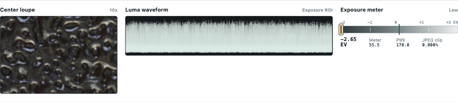
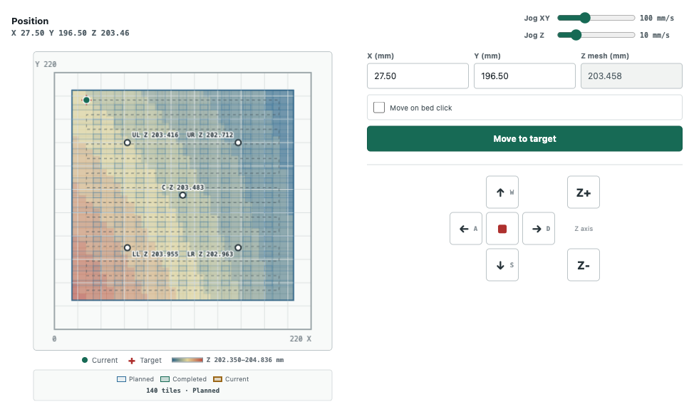

# Capture Workspace

The Capture workspace is organized into Hardware, Camera and position, and Scan job. All controls reflect service state; a disabled command is unavailable because a prerequisite is missing or another operation owns the scanner.

## Top Status

The header always shows:

- service state, such as Idle, Moving, Calibrating, Scanning, Editing, or Faulted;
- the current phase message;
- completed and total units when the phase is finite;
- an ETA derived from measurements in that phase;
- cooperative **Cancel** and hardware **Emergency stop**.

An expanding autofocus sweep has no known final sample count, so it reports completed samples and `ETA unavailable` until the search converges. It does not invent a total.

## Motion Stage

Select a serial port and connect. Coordinates remain uninitialized until Home, Set origin, or safe remembered-position restore succeeds. Motion controls remain disabled before initialization.

Home runs the printer's firmware-defined `G28`, raises to Z203, and moves to X110/Y110. Browser speed controls cannot change firmware homing speed.

Restore saved position sends `G92` with the last confirmed XYZ for the same serial port. It performs no physical measurement or movement. Do not use it after power loss, released steppers, manual movement, or any uncertain position continuity.

## Nikon Panel

**Take control** releases the macOS PTP camera process. **Connect** opens the persistent gphoto session. ISO and shutter are global values used by test capture, calibration, focus, white balance, and scanning.

MarlinScan uses three capture profiles:

| Profile | Nikon quality | Use |
| --- | --- | --- |
| Preview | Small / JPEG Basic | Automatic stills after motion |
| Analysis | Large / JPEG Fine | Test, exposure, focus, and gray reference |
| RAW | Large / NEF+Fine | Calibration verification and scan tiles |

The panel shows both the configured profile and the profile that produced the displayed still.

## Latest Capture And ROIs

Exposure, Focus, and Gray are independent normalized rectangles. Select a mode, then drag its region over the image. Reset ROI restores the selected region to the center 60 percent.

- Exposure should represent the tones whose midrange should drive shutter selection. Small specular highlights can remain outside or inside the region; they do not become a hard failure.
- Focus should contain fine, high-contrast, non-repeating detail at the intended subject plane.
- Gray should contain a neutral reference with usable, unsaturated samples in every sensor channel.

## Inspection Tools

The 10x center loupe checks local detail in the latest still. The waveform shows luma distribution in the Exposure ROI. The meter uses robust middle tones; P99 and JPEG clipping remain diagnostics.

Auto exposure changes shutter only. It first finds a coarse JPEG exposure, then checks a matching NEF and moves the brightest CFA-channel P99 toward 85 percent of the black-to-white sensor range. That target is an optimization, not an acceptance gate. High-contrast scenes may legitimately contain both saturated highlights and black shadows. Meaningful sensor saturation can shorten shutter by one available step; any remaining endpoint loss is reported rather than hiding the completed exposure.

## Position And Focus Surface

The bed map accepts a click target and shows current position, target, scan footprints, route, and focus information. With a focus surface active, changing X/Y computes Z from that surface. Z-only jog remains deliberate manual control.

Single autofocus creates one constant-Z surface from the current point. Grid autofocus measures lower-left, upper-left, center, lower-right, and upper-right positions and fits one bilinear surface. The center is both part of the fit and shown independently on the map.

## Measurements

The right-side log keeps current-session exposure readings, focus samples and selected peaks, and white-balance gains. Each entry records phase, capture profile, parameter, result, time, and whether it was accepted. This is evidence for diagnosing a calibration instead of a generic pass/fail light.

## Calibration Tab

The shared bounds define finished-image physical coverage. Standalone actions update one calibration component:

- Auto exposure
- Single autofocus
- Grid autofocus
- Calibrate gray white balance

**Run all calibration** performs preliminary exposure, five-point grid focus, final RAW-aware exposure, and gray white balance. Scan becomes available after exposure, either valid focus model, and white balance exist.

## Scan Tab

Camera footprint describes one tile's physical coverage. Overlap and bounds determine tile count and redistributed spacing. The displayed DPI is an estimate from the latest Large analysis/RAW dimensions and footprint; final stitch metadata is authoritative.

Settle is the delay after the final XYZ movement and before capture. It defaults to 1000 ms because the camera and macro mount require time to stop vibrating. Increase it if fine detail shows directionally consistent blur; measure again rather than compensating with sharpening.

Normal acquisition downloads the fine JPEG first, displays it, downloads the matching NEF, and overlaps RAW development with later captures. Quick acquisition stores exact JPEG+NEF pairs on the camera card during motion, imports them afterward, and then develops and stitches. Quick owns only paths returned for that job and deletes those remote pairs on success, cancellation, or failure.

## Results Tab

Results shows calibration, quick standalone calibration values, the latest stitched preview, downloads, and output folders. A link exists only when the corresponding file exists. See [Outputs](outputs.md) before deciding which artifact is the archival master.
