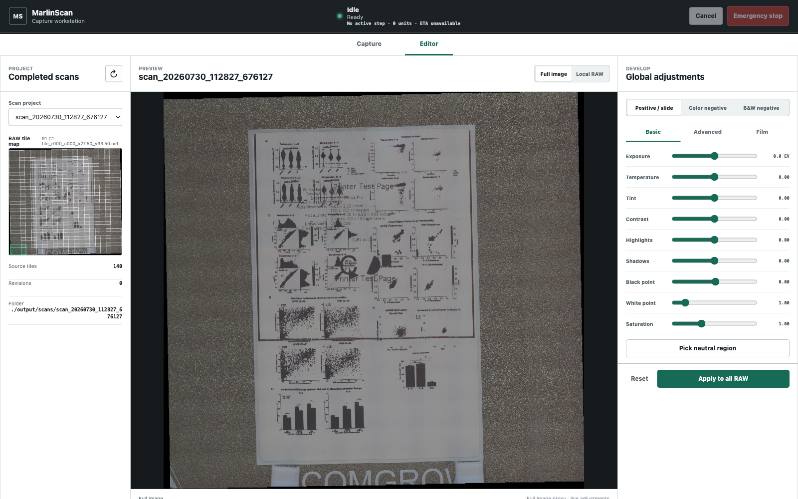
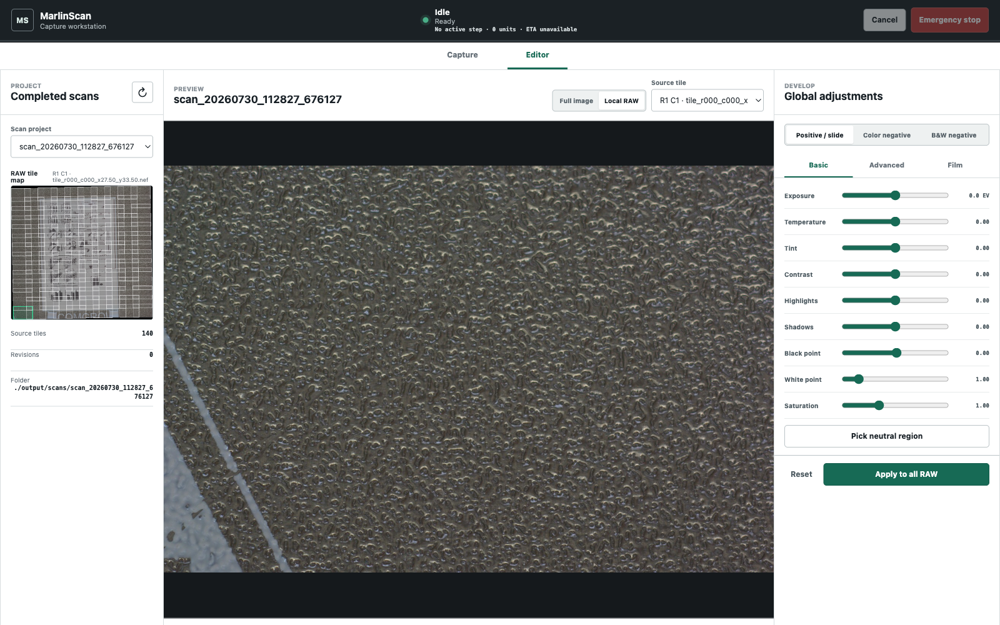
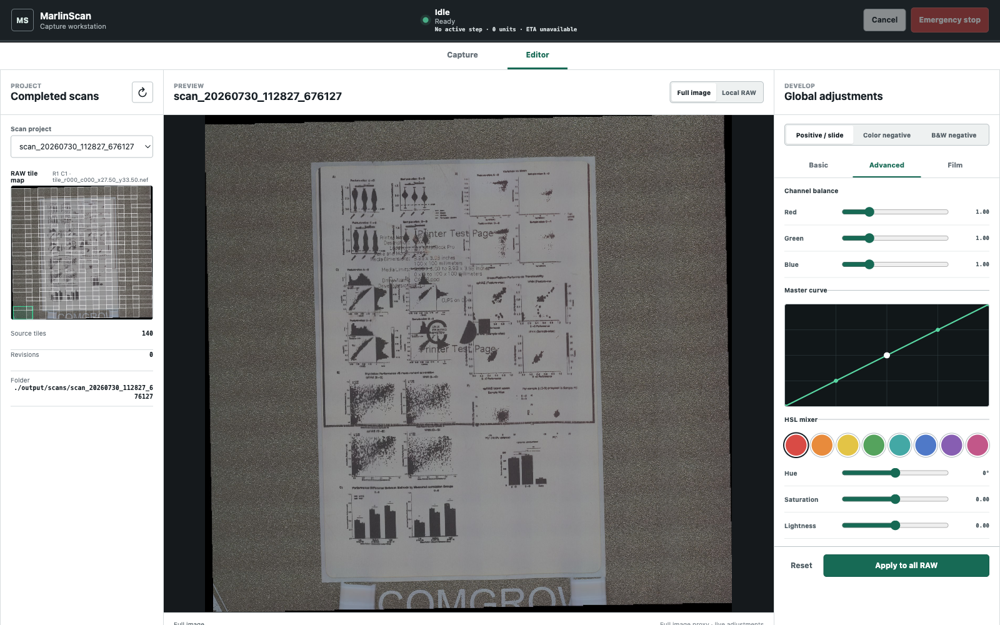
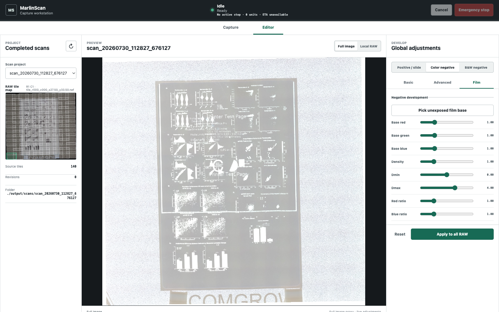

# Image Editor

The Editor is a separate top-level workspace for global, repeatable RAW development. It does not control hardware and intentionally has no brushes, adjustment masks, selections, dodge, or burn. One recipe applies to every tile so adjacent images cannot drift independently.

## Project And Preview Model



Select a completed RAW scan in the left pane. The project list survives service restarts, including custom scan roots previously used by the service.

The Full Image view loads `mosaic_thumb_2000.jpg` once into a GPU texture. Every control update is rendered on the next browser animation frame. The full mosaic is not opened, recomposited, or transferred for each edit.

The RAW tile map overlays actual saved alignment bounds on the stitched thumbnail. Click any rectangle, use the tile list, or use arrow keys on the map to open the corresponding Local RAW view.



Local RAW performs one server request for a neutral JPEG generated from that tile's scene-linear working image. It then uses the same cached GPU recipe. Selecting another tile replaces the local texture. Returning to Full Image switches back to the already loaded texture without a request.

Both views are 8-bit display proxies. They cannot show values above display white, signed wide-gamut values, or every subtle RAW adjustment. Local RAW has more spatial detail but is still a JPEG proxy. Nonlinear preview operations also occur after the thumbnail was feather-composited, while final rendering edits each float tile before composition, so overlap tones can differ slightly. **Apply to all RAW** is the authoritative float32 operation.

## Material Modes

Choose the source material before judging tone and color:

- **Positive / slide** preserves normal polarity and optionally repairs channel-dependent fade.
- **Color negative** converts base-relative transmission to optical density, inverts it, and provides color density ratios.
- **B&W negative** uses the same density model, then produces a neutral luminance result without irrelevant color-ratio controls.

Changing material updates the preview immediately and shows only relevant Film controls.

## Basic

Basic contains exposure, temperature, tint, contrast, highlights, shadows, black point, white point, and saturation.

**Pick neutral region** temporarily enables a rectangle over the active preview. Draw over a neutral subject area. Keyboard users can move the initial rectangle with the arrow keys, resize it with Shift+Arrow, apply with Enter, or cancel with Escape. MarlinScan samples the unedited display proxy and sets the global temperature/tint values. The rectangle disappears after sampling and is not retained as a local correction. For the best estimate, use Local RAW and avoid a region clipped in the proxy; the saved values are then applied to the float RAW tiles.

For negatives, perform light-source white balance before using film-base and print-style controls. A neutral reference photographed under the same light is preferable to guessing from image content.

## Advanced



Channel balance scales linear Rec.2020 red, green, and blue globally.

The master curve has five fixed input positions from black through white. Drag a point vertically. Keyboard Left/Right selects a point; Up/Down changes it by 0.01. The curve changes luminance while retaining values below zero and above one outside its display range.

The HSL mixer has Red, Orange, Yellow, Green, Aqua, Blue, Purple, and Magenta bands. Select a swatch, then adjust Hue, Saturation, and Lightness. Adjacent bands interpolate smoothly. HSL is useful for global dye and print-color correction; it is not a replacement for a color target and calibrated camera profile.

## Positive / Slide Film Tools

Fade repair blends toward per-channel black/white normalization. Keep it at zero when the positive is already balanced. For a faded slide, set each channel's black and white endpoints from representative clear and dense regions, then increase Fade repair only as far as needed.

Channel endpoints must remain ordered. Apply is blocked when any channel white is not greater than its black.

## Color Negative Film Tools



Use **Pick unexposed film base** on a clear piece of the same film outside the exposed frame. MarlinScan estimates the mean linear Rec.2020 red, green, and blue transmission from the unedited display proxy and records it as the global base. Use Local RAW and confirm that the base is not clipped. This neutralizes the orange base before density inversion; it does not create an image mask.

The density operation is base-relative:

```text
density = -log2(max(channel / film_base, epsilon))
```

Density scales the overall response. Dmin and Dmax map the useful density interval to the working tonal interval. Red ratio and Blue ratio correct channel response relative to green. Start with ratios at 1.0 and change them only after selecting a credible film base.

This design follows photographic sensitometry concepts such as film base plus fog, Dmin/Dmax, and characteristic-curve endpoints. It is implemented directly for MarlinScan's scene-linear Rec.2020 pipeline. NegPy is not embedded: its current package requires Python 3.13, exposes no stable headless processing API, and its published wheel omits the processing subpackages.

## B&W Negative Film Tools

Pick the unexposed base and set density range as with color negative. The result is converted to Rec.2020 luminance and replicated to neutral RGB. Red/blue density controls remain hidden because they would imply color information that the output discards.

## Applying A Recipe

Select **Apply to all RAW** when the proxy looks correct and critical areas have been checked in Local RAW. MarlinScan then:

1. validates and writes the versioned recipe;
2. redevelops every original NEF into the recorded scene-linear Rec.2020 space;
3. applies the same material and global edit recipe to every tile;
4. reuses the original JPEG-derived transforms;
5. composites a new float32 mosaic;
6. writes the working EXR, flat TIFF, OME pyramid, JPEG preview, and metadata;
7. removes scratch files and publishes an immutable numbered revision.

The editor progress panel reports the active phase, completed/total units, and ETA. Cancel is cooperative. A cancelled or failed partial revision is removed; original scan files and earlier revisions are untouched.

Revisions live under:

```text
scan_.../revisions/revision-001/
scan_.../revisions/revision-002/
```

Each has its own `edit_recipe.json` and `revision_meta.json` so the output is attributable and reproducible.

## Performance Expectations

On the measured 140-tile, 1.386 GP project in desktop Chrome:

| Interaction | Measured time |
| --- | ---: |
| Initial Full Image proxy | 194-264 ms |
| First Local RAW tile | 890-895 ms |
| Cached Local RAW to Full Image | 25-29 ms |
| Slider input through two rendered frames | 25-27 ms |

Those interactions generated no `/api/editor/preview` requests. Full apply remains intentionally much slower because it reads and develops every NEF and writes gigapixel artifacts.
