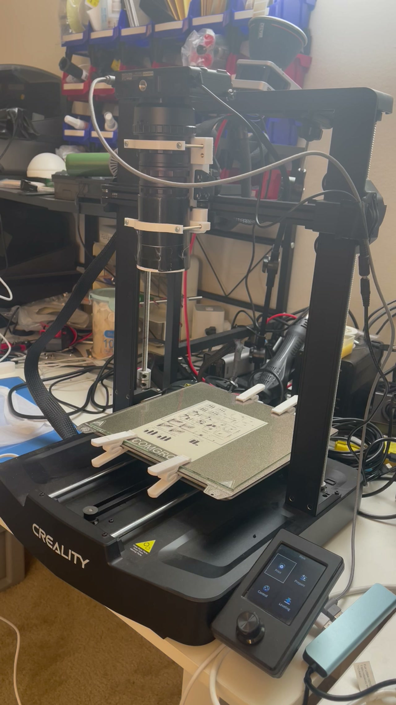

# Hardware And Physical Setup

MarlinScan assumes a rigid, downward-looking camera over a flat subject on a Marlin-controlled XY/Z platform. Software calibration cannot correct a moving mount, changing illumination, or a subject that shifts between tiles.

## Required Components

- Marlin-compatible printer or motion stage with known XYZ bounds
- Nikon 1 J4 and data-capable Micro-USB cable
- rigid camera and lens mount
- manual lens with physical aperture and focus controls
- fixed, flicker-free illumination
- neutral gray reference photographed under the scan light
- subject retention that does not enter the optical area
- sufficient local storage for NEFs, working tiles, mosaics, and revisions

## Camera Geometry

Mount the sensor plane as parallel to the subject plane as practical. Grid autofocus can compensate for a moderate height slope, but it does not correct perspective, lens tilt, or a subject that moves.

Measure the physical width and height visible in a Large Nikon frame at the chosen working distance. Enter those values as Camera footprint. The current rig uses 25 x 17 mm. Changing lens, focus, extension, camera height, or sensor crop invalidates that measurement and the DPI estimate.

Set aperture physically before exposure and focus calibration. Smaller apertures increase depth of field but eventually lose detail to diffraction and may require longer exposures. Choose the aperture from actual resolved-detail tests, not f-number alone.

## Rigidity And Stabilization

The camera mass and macro extension act as a long lever. Check:

- no play in the carriage or camera plate;
- no rotation at lens adapters or extension tubes;
- cables have a service loop and do not pull differently across the bed;
- belts, wheels, rails, and Z screw are adjusted consistently;
- the subject is clamped outside the scanned rectangle;
- the nozzle or unused toolhead cannot strike the subject or mount.

Use the 1000 ms settle default as a starting point. If Local RAW tiles show movement blur, increase settle and reduce acceleration or speed before changing image-processing controls.

## Illumination

Keep light output, spectrum, angle, and room spill fixed from calibration through the final capture. Avoid PWM sources whose output varies during the shutter interval. Diffusion should be stable and mechanically separate from moving parts where possible.

For transmissive negatives, use an even backlight and control reflections from the lens side. Include clear unexposed film for base sampling. For reflective originals, place the gray reference in the same light and orientation as the subject.

## Cable And Travel Safety

Before Home or any scan, move the unpowered or safely jogged mechanism through the full intended envelope and inspect cable slack at every corner. The post-home move includes Z203 and X110/Y110. Keep the Nikon USB connector, camera body, lens, mount, clamps, subject, and lighting clear of the complete path.

Keep access to printer power and the MarlinScan Emergency stop. Cancel is not an immediate motion interrupt.

## Storage

The measured 140-position scan occupied 67 GB before editor revisions. Ensure the working volume has room for source files, a full float mosaic, two large TIFFs, and temporary compositing data at the same time. Prefer fast internal SSD storage. Do not scan directly to a network share whose latency or disconnection can interrupt atomic file publication.

## Validation Before A Large Job

1. Capture one Large JPEG+NEF at the intended ISO, shutter, aperture, and illumination.
2. Verify focus in the center and corners of the physical coverage.
3. Run Single or Grid autofocus and inspect every reported peak.
4. Scan a 2 x 2 or 3 x 3 representative area.
5. Inspect Local RAW tiles for vibration and the mosaic for alignment or exposure seams.
6. Confirm the output folder and free space.
7. Only then start the full path.
