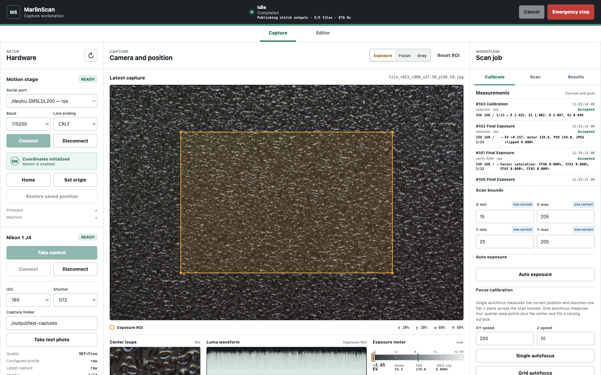
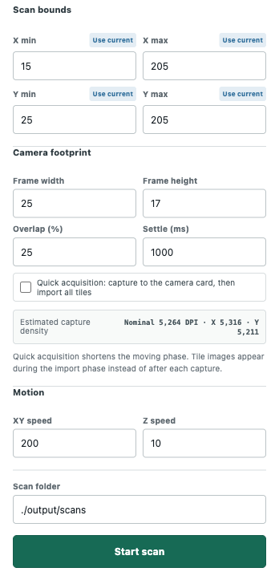
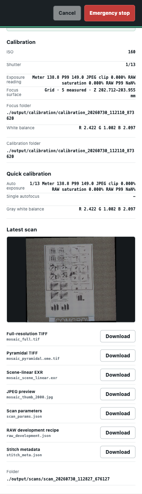

# Quick Start

This walkthrough assumes the camera mount, subject, illumination, manual aperture, and lens focus have already been set physically. Read [Hardware](hardware.md) and [Safety and Recovery](../README.md#safety-and-recovery) before moving the stage.

## 1. Launch

From the repository working directory:

```bash
conda activate 3dprinter
python -m v3se_printer
```

MarlinScan opens `http://127.0.0.1:8000/`. Test captures, calibration, and scans default to `./output/` under this working directory.

## 2. Connect And Initialize Motion

1. Select the printer serial port, baud rate, and line ending.
2. Select **Connect**.
3. Initialize coordinates using exactly one method:
   - **Home** when the complete homing, Z203, and X110/Y110 path is clear.
   - **Set origin** when the current physical location deliberately represents zero.
   - **Restore saved position** only when the machine has not moved physically since MarlinScan last confirmed that position.
4. Confirm that Motion stage reports **Ready** and that X, Y, and Z are credible.

## 3. Connect The Nikon

1. Turn on the Nikon 1 J4 and attach a data-capable Micro-USB cable directly to the Mac.
2. Close Photos, Image Capture, and other camera clients.
3. Select **Take control** to release the macOS camera daemon.
4. Select **Connect**.
5. Choose the global ISO and shutter, then select **Take test photo**.

The latest test JPEG should appear in the central view. The J4 USB driver does not provide video live view; MarlinScan refreshes this view with still captures.



## 4. Inspect And Position

1. Drag the Exposure ROI over representative subject tones.
2. Drag the Focus ROI over fine, high-contrast detail.
3. Drag the Gray ROI over a neutral gray reference.
4. Inspect the center loupe, luma waveform, midtone meter, P99, and clipping diagnostics.
5. Use the bed map, XYZ fields, or hold-to-jog controls to place the camera.

Automatic preview stills follow Home, position restore, completed absolute moves, and the end of a jog.

## 5. Set Shared Scan Bounds

Calibration and Scan show the same coverage rectangle. Editing any X/Y minimum or maximum updates the matching field in the other tab. **Use current** copies the corresponding live X or Y coordinate into both views.

Defaults are X15-205 mm and Y25-205 mm. These are finished-image edges, not camera-center limits.

## 6. Calibrate

Choose one focus model:

- **Single autofocus** measures the current XYZ point and assumes the entire declared coverage is one constant Z plane.
- **Grid autofocus** measures four quarter-area centers plus the exact center and fits a varying focus surface.

Then run exposure and gray white balance as separate actions, or select **Run all calibration** to run auto exposure, five-point grid autofocus, and gray white balance. A successful calibration reports the selected shutter, exposure diagnostics, focus observations, Z range, and white-balance gains.

## 7. Configure The Scan

1. Confirm the shared bounds.
2. Confirm the measured camera footprint, initially 25 x 17 mm.
3. Select overlap, initially 25 percent.
4. Confirm the estimated X, Y, and nominal DPI.
5. Use the 1000 ms stabilization default unless measurements support a different value.
6. Leave **Quick acquisition** off for immediate local files and live tile updates. Enable it only when the shorter moving phase is worth deferring import and display.
7. Confirm the folder, initially `./output/scans`.



## 8. Scan

Select **Start scan**. The top status and position map report the current phase, completed/total units, and ETA. The route is serpentine. Each tile uses the calibrated global exposure, white balance, and focus surface.

Select **Cancel** to stop cooperatively while retaining verified printer connection and position. Use **Emergency stop** only for an immediate motion hazard.

## 9. Review Outputs

Successful work returns to Idle and opens Results. Download links appear only for files that exist. The important outputs are:

- original per-tile NEFs and JPEGs in the scan directory;
- `mosaic_scene_linear.exr` for full-resolution scene-linear editing;
- `mosaic_full.tif` for flat 16-bit delivery;
- `mosaic_pyramidal.ome.tif` for tiled multi-resolution viewing;
- `mosaic_thumb_2000.jpg` for quick review.



## 10. Edit And Regenerate

Open **Editor**, select the completed scan, and adjust the cached Full Image proxy. Select a rectangle in the RAW tile map to inspect that source tile. Choose Positive/Slide, Color Negative, or B&W Negative, then use Basic, Advanced, and Film controls.

Select **Apply to all RAW** only when the recipe is ready. MarlinScan redevelops every NEF, uses the saved alignment, reports progress and ETA, and writes an immutable numbered revision without changing the originals.
